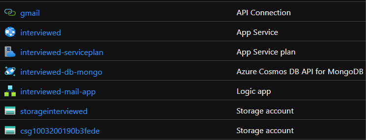

# Interviwed.

&nbsp;&nbsp;&nbsp;&nbsp;An awesome and robust interview platform where interview sessions can be scheduled, taken and assessed virtually and with ease.

> With the help of Interviewed the workflow for assessing and keeping track of candidates is optimised and easier than ever.

&nbsp;&nbsp;&nbsp;&nbsp;Interviewed is powered by the following

- 🌐 Hosted with [Azure App Service](https://azure.microsoft.com/en-in/services/app-service/)

- 🌌 Powered by [Azure Cosmos DB](https://azure.microsoft.com/en-us/services/cosmos-db/)

- 💡 Emails are sent to candidates with the help of [Azure Logic Apps](https://azure.microsoft.com/en-in/services/logic-apps/)

- 📦 The videos of the candidates are stored with the help of [Azure Blob Storage](https://azure.microsoft.com/en-in/services/storage/blobs/)

---

#### Workflow

- Login as a HR and schedule a virtual interview/assesment to a candidate with their information like email, etc.

- As the interview/assessment is scheduled candidates receive an email with the link for taking the assessment with their credentials and instructions for taking the test.

- The candidates are presented with a set of predefined questions and they can project their responses which is recorded in real time.

- Once the candidate completes the final question the recorded video is then pushed to the azure blobs.

- The HR can view the dashboard for the status of the scheduled interview and if the test is completed by the candidate the HR can download the video of the particular candidate for assessing.

#### Check it out from [here](https://interviewed.azurewebsites.net/register)

---

### Screens from Interviewed.

##### Login

##### Register

##### Dashboard

##### Schedule

---

### Azure Services Used

---

#### Improvements (Scope)

- [ ] Use Azure Face API and Azure Cognitive Service to perform real-time analysis on the candidate's asessment video.

- [ ] Create a portal where candidates can submit their resume and other certificates for further onboarding or evaluvating.

- [ ] Create a portal where candidates can check for available posts and apply for the same.

---

 
  
  
  
  

