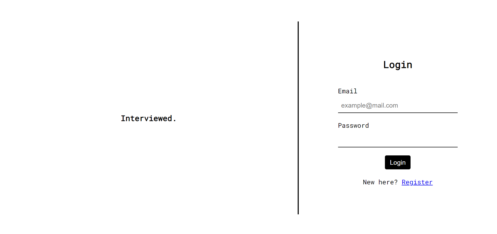
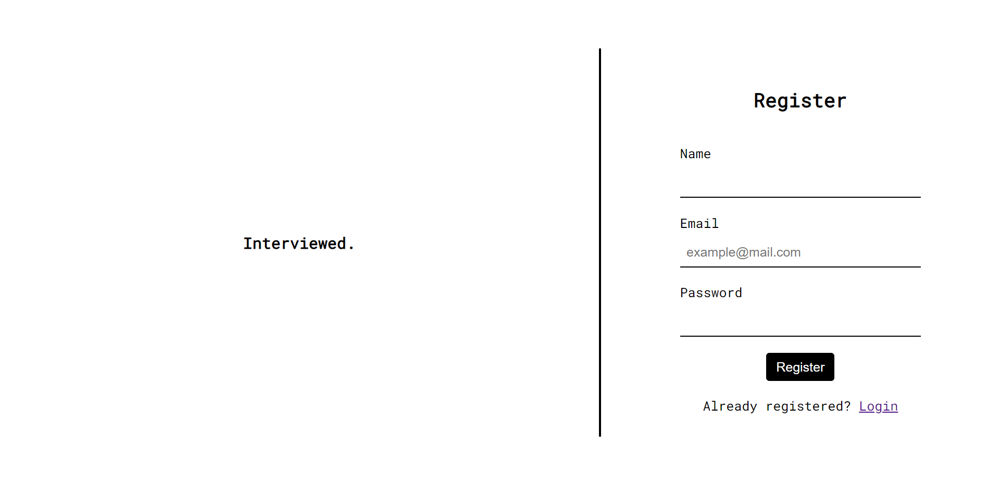
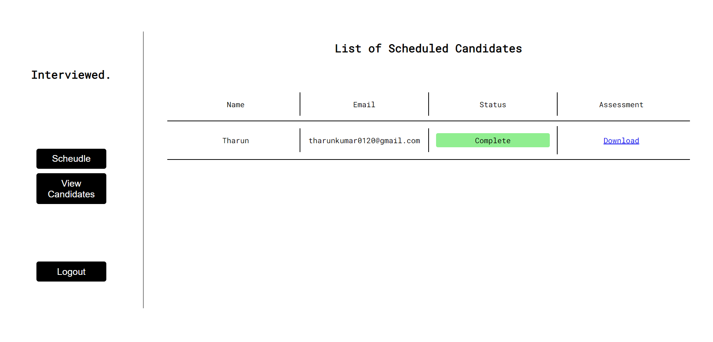
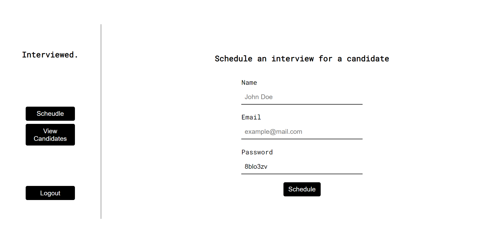

  
  <h1>Interviewed</h1>
  
A robust virtual interview platform for seamless candidate assessment

  
  

## 🎯 Overview

Interviewed is a comprehensive platform that streamlines the interview process by enabling virtual assessments, automated scheduling, and candidate tracking. It provides a seamless experience for both HR professionals and candidates.

## ⚡ Key Features

- **Automated Scheduling** - Easy interview scheduling with automated email notifications
- **Real-time Recording** - Record candidate responses to predefined questions
- **Secure Storage** - Videos stored safely in Azure Blob Storage
- **Dashboard Analytics** - Track interview status and candidate progress
- **Cloud-Powered** - Built on reliable Azure cloud infrastructure

## 🏗️ Architecture

The application leverages several Azure services:

- 🌐 **[Azure App Service](https://azure.microsoft.com/en-in/services/app-service/)** - Application hosting
- 🌌 **[Azure Cosmos DB](https://azure.microsoft.com/en-us/services/cosmos-db/)** - Data storage
- 💡 **[Azure Logic Apps](https://azure.microsoft.com/en-in/services/logic-apps/)** - Email automation
- 📦 **[Azure Blob Storage](https://azure.microsoft.com/en-in/services/storage/blobs/)** - Video storage

## 🔄 Workflow

1. HR schedules interview and provides candidate information
2. Candidate receives email with credentials and instructions
3. Candidate answers questions while being recorded
4. Recording is automatically uploaded to Azure
5. HR reviews recording and assesses candidate

## 📸 Screenshots

View Screenshots

### Login

### Register

### Dashboard

### Schedule Interview

## 🌟 Future Improvements

- [ ] Implement Azure Face API for sentiment analysis
- [ ] Add real-time analytics using Azure Cognitive Services
- [ ] Enable multi-language support
- [ ] Add interview templates and question banks

---

  
  
  
  
  

